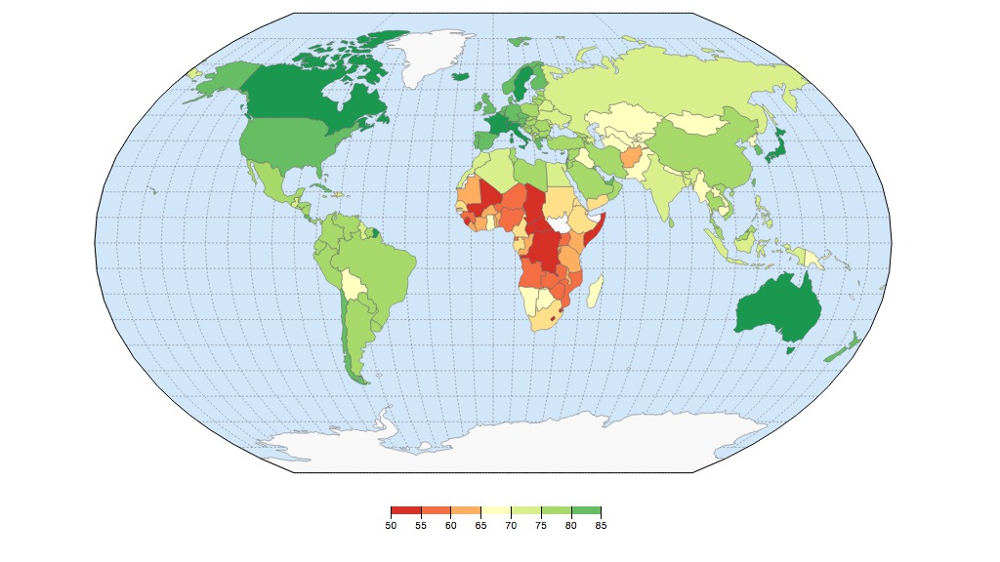
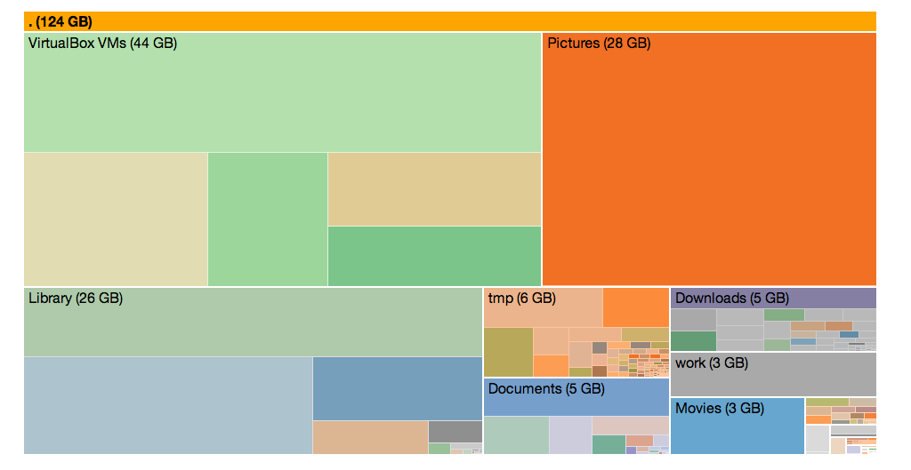

Pigshell
========
*unix the web*

[_Pigshell_](http://pigshell.com) is a pure client-side Javascript app running
in the browser, which presents resources on the web as files.  These include
public web pages as well as private data in Google Drive, Dropbox, Facebook and
even your desktop. It provides a command line interface to construct pipelines
of simple commands to transform, display and copy data.

**_Pigshell_ is free software**, released under the GNU GPLv3.

_Pigshell_ is inspired by Unix philosophy: Everything is a file. Programs
should do one thing well. Create tools by stringing together a combination of
simpler tools. Like human language, CLIs give us freedom of expression - we
can generate infinite meaningful combinations from a limited number of words 
to effectively deal with the combinatorial explosion of variety thrown
up by the modern web environment.

### We're far from done, but here are some of the things you can do right now:

* Backup Google Drive to your desktop: `cp -rv /gdrive/<username> /home`
* "Mount" multiple Google Drive and Dropbox accounts, copy files from anywhere
  to anywhere.
* Plot your friends' locations on a map: `map /facebook/friends/*`
* [scrape_web_page |  extract_table | draw_chart](http://bl.ocks.org/ganeshv/raw/b971989c337e958c0531/)

## Installation ##

Simply visit [http://pigshell.com](http://pigshell.com) and type away. Modern
(~early 2014) versions of Chrome, Firefox and Safari should work fine on all
desktop platforms. Mobile browsers, Internet Explorer and others are not supported at the moment.

Running the [psty](src/doc/psty.md) server on your desktop is strongly recommended.
It exposes a local directory for _pigshell_ to use as a `/home`, serves as a
proxy HTTP server, and lets _pigshell_ pipe web data through desktop Unix
utilities. _Psty_ works only on Unix currently.

## Hello, World ##

Click on the first example in the sidebar, or type the following at the prompt:

    cat http://pigshell.com/sample/life-expectancy.html | hgrep table.wikitable | table2js foo country data | iframe /usr/template/d3-worldmap1

We got a page from a website, extracted a table, converted it to a list of
Javascript objects and fed it to a D3-based template for visualization.

A _pigshell_ pipeline lazily processes streams of _objects_. Commands should be
considered as generator functions yielding objects, composed using the pipe
operator. The pipeline starts when the last member (an implicit `Stdout`) asks
the upstream command for an object, which in turn asks its upstream command and
so on, until the command at the head reluctantly yields an object. It is
processed and "returned" downstream, until it hits `Stdout` which displays it
on the terminal. `Stdout` has an insatiable appetite for objects, so it asks
for one more, and the process continues until a `null` object, signifying the
end of the pipeline, makes its way down. Unlike Unix commands, _pigshell_
commands are _not_ independently executing processes.

## Using the Terminal ##

The terminal should be familiar to Unix/bash users, featuring tab completion,
history, and Emacs-style CLI editing shortcuts.

The primary prompt is `pig<basename_of_cwd>$`. When a command is running,
a secondary prompt of `> ` is displayed, which can be used to typeahead
commands.

**Ctrl-C** and **Ctrl-Z** kill and pause the current foreground command
respectively, while **Ctrl-B** "backgrounds" it (roughly like an **Ctrl-Z** +
`bg` in _bash_).

A command sequence (e.g. `ls|sum; sleep 10; echo done`) issued on the CLI will
fill its output area as and when objects are emitted. The prompt associated
with a command sequence glows green or amber while it is running or stopped,
and on its completion settles to red or black depending on its exit status.

## Basic commands ##

`ls`, `cd`, `mount`, `cat` work similarly enough to their Unix namesakes to
help you explore the system.

The `ps` command displays a list of running pipelines.  To kill a long-running
pipeline, use `ps` to find its PID and `kill`. You can also `stop` and `start`
pipelines.

Many commands support a `-f` option to use a given object field, and
`-e` to specify a Javascript expression. For instance:

    ls /gdrive/username@gmail.com | grep -f mime spreadsheet | grep -e 'x.mtime > Date.parse("Dec 31, 2013")' | cp .

The above command finds all files in the given user's GDrive containing the
string "spreadsheet" in their `mime` property, selects those files which
those files modified since Dec 31, 2013 and copies them to the current
directory.

## Attaching Data Sources ##

To attach Google Drive, Picasa, Dropbox, Facebook, click on the corresponding
icon under **Data Source** in the sidebar. Attaching an account automatically
mounts associated filesystems under `/gdrive`, `/picasa`, `/dropbox` and
`/facebook` respectively.

*Data privacy is assured: _pigshell_ is a pure Javascript app, and data flow
happens directly between your browser and data sources like Google and
Facebook. No access tokens or user data are ever visible to or stored by the
pigshell.com server.*

Running the `mount` command without arguments displays the list of currently
mounted filesystems.

## Facebook ##

**NOTE (May 2015)**: The Facebook API no longer supplies the entire friends
list, only those who have used and approved the _pigshell_ app. This breaks
a lot of the functionality described in the Facebook section and will be
modified in later revisions of this document.

Everything is a file. Friends are files too. After attaching your Facebook
account,

    cd /facebook/friends; ls

will give you a list of your friends. 

Where in the world are my friends?

    map /facebook/friends/*

`map` is a command which plots files with location attributes on a map.
Another way of doing this would be

    ls /facebook/friends/ | map

_Pigshell_ passes objects over pipes. In this case, `ls` emits a stream of
*file* objects, which are consumed by map.

Let's refine the above query: Where are all my male friends?

    ls /facebook/friends | grep -f gender "^male" | map

`grep` is a generic filter command, which may filter either by an object's text representation, or a specific field - in this case, gender.
  
How many friends do I have?

    ls /facebook/friends | sum

Pie chart of relationship status of all female friends

        ls /facebook/friends | grep -f gender "female" | chart -t pie -o field=relationship_status

## $HOME sweet $HOME ##

Get a `/home`. <a href="./psty.py" download="psty.py">Download _Psty_</a>, run it on your desktop:

    python psty.py -a -d /some/dir # Run in DESKTOP SHELL (bash), not pigshell

and on _pigshell_,

    mount http://localhost:50937/ /home # Run in PIGSHELL, not desktop

The _psty_ server runs only on Linux and Mac OS at present. It has been
reported to work on Windows using Cygwin.

Now you can read and write to `/home` it will be backed by `/some/directory`.
`cat` images and PDFs stored on your desktop inside `/some/directory`.

This mount command needs to be typed every time you start or reload the page.
To do it automatically, 

    echo "HOME=/home; mount http://localhost:50937/ $HOME" >/local/rc.sh

/local/rc.sh is a script stored in the browser's LocalStorage and will be
invoked every time http://pigshell.com is (re)loaded. You need to create a
/local/rc.sh on every browser on which you use _pigshell_.

## Data Movement ##

Assuming you're running _psty_, backing up Google Drive to your desktop is
as simple as

    mkdir /home/drivebackup
    cp -rv -X /Trash /gdrive/username@gmail.com /home/drivebackup

More details on [using Google Drive](src/doc/gdrive.md) with _pigshell_.

Backing up a Picasa album:

    mkdir /home/foo; cp /picasa/foo/* /home/foo

Similarly, creating an album and uploading a bunch of pictures to Picasa:

    mkdir /picasa/bar; cp /home/barpics/*JPG /picasa/bar

(note that album creation and uploads to Picasa require _psty_'s proxy services)

Copying random URLs to your desktop also works:

    cp -c http://ftp.freebsd.org/pub/FreeBSD/ISO-IMAGES-amd64/10.0/FreeBSD-10.0-RELEASE-amd64-bootonly.iso /home

The `-c` option continues where it left off, so you can resume interrupted
downloads.

If you don't have _psty_:

-   You can copy the files to `/downloads`, and it will
    get to your browser's default download folder. Note that you cannot see
    anything inside the `/downloads` directory, it's just a pseudo-target to
    trigger a browser download. For example,

        cp /picasa/foo/DSC_1290.JPG /downloads

-   Click on _Upload Files_ and select a file or files from your desktop.
    These files are now visible under the directory `/uploads`. Use `ls`
    to verify that they're there. Now use `cp` to copy them to the
    target directory.

        cp /uploads/cat.jpg /gdrive
        cp /uploads/cat.jpg /facebook/me/albums/MyCat/

## Data conversion ##

Most filesystem `read()` operations generate blobs. It is up to the consuming
command to convert incoming data into the type it likes. In the command

    cat http://pigshell.com/sample/photos/bchips.jpg

`cat` returns a blob. The terminal figures out that the blob contains PNG data,
and displays it as a canvas. Similarly,

    cat http://pigshell.com/sample/clickingofcuthbert.pdf

is detected as a PDF and displayed using pdf.js. In case it could not figure
out the contents, it attempts to convert it to text and displays it as the
usual weird-character porridge (though it is mercifully silent, unlike Unix
terminals)

In some cases, you have to manually convert data between stages in the 
pipeline. For example,

    cat http://pigshell.com/sample/README.md | to text | jf 'x.split("\\n")' | sum

implements a poor man's `wc`: `cat` returns a blob, `to` converts it to text,
`jf` splits it into lines, `sum` counts the number of objects it gets. A `cat
... | sum` would have returned 1, since only one object (a blob) was presented
to `sum`.

## URLs as files ##

Absolute URLs can be used in most places where a file path is expected.
Mounting an HTTP URL exposes all links within that page as directories. To
mount arbitrary, non-CORS-enabled URLs, you need to run _psty_.

    mount http://pigshell.com/sample/ /mnt; cd /mnt; ls
    cat oslogos.png
    cat .
    cat . | to text

## Processing on the desktop - Wsh ##

_Psty_ runs a websocket service, effectively converting any Unix utility
which uses stdin/stdout into a potential member of the _pigshell_ pipeline.
For instance, if you have ImageMagick installed,

    cat http://pigshell.com/sample/oslogos.png | wsh /usr/local/bin/convert -implode 1 - - | to -g blob

will grab a png file from the web, pipe it through ImageMagick on the desktop,
and display the result in _pigshell_.

To visualize disk usage in a zoomable treemap,

    wsh du /Users/foo | to -g text | iframe /usr/template/d3-du-treemap

(Note that `du` of a deep tree may take a while, try with a shallow directory
tree first)

## Status ##

_Pigshell_ is under active development. No commands, APIs or interfaces are
frozen at this point. Tests and documentation are very sparse at the moment.

The [user guide](src/doc/pigshell.md) has more detailed coverage of _pigshell_
concepts and the scripting language.

## Contact

Email us at <pigshell@googlegroups.com>, <dev@pigshell.com> or follow
[@pigshell](https://twitter.com/pigshell).
